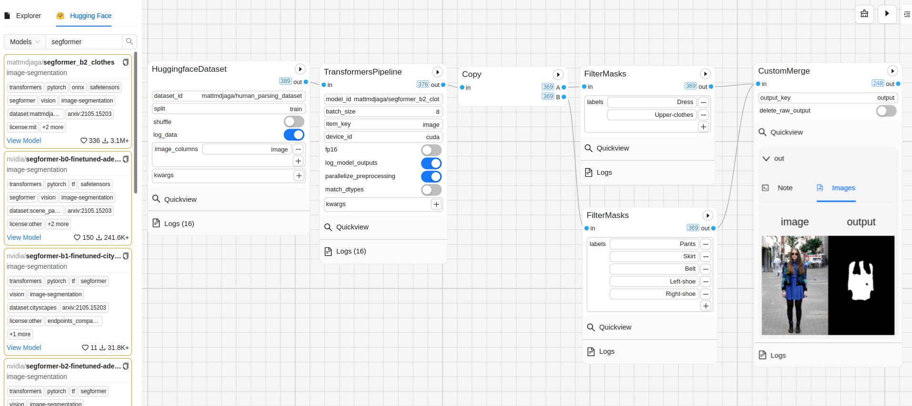

  

  <h1 align="center">Graphbook Hugging Face</h1>

  

    Build No Code Hugging Face AI Pipelines
  

You can build efficient DAG workflows or AI pipelines without any code. This is a Graphbook plugin that lets you drag and drop Hugging Face models and datasets onto Graphbook workflows. This plugin contains a web panel for searching and drag-and-dropping models and datasets from [Huggingface Hub](https://huggingface.co/) onto their graphbook workflows.

## Packaged Nodes

Graphbook Hugging Face contains the following nodes:

* `TransformersPipeline` step for model usage from transformers package
* `HuggingfaceDataset` step for dataset usage from the datasets package
* And numerous `Post Processing/*` steps for post processing of model outputs

## Getting started
1. `pip install graphbook_huggingface graphbook transformers datasets`
1. `graphbook --config hf.config.yaml`

